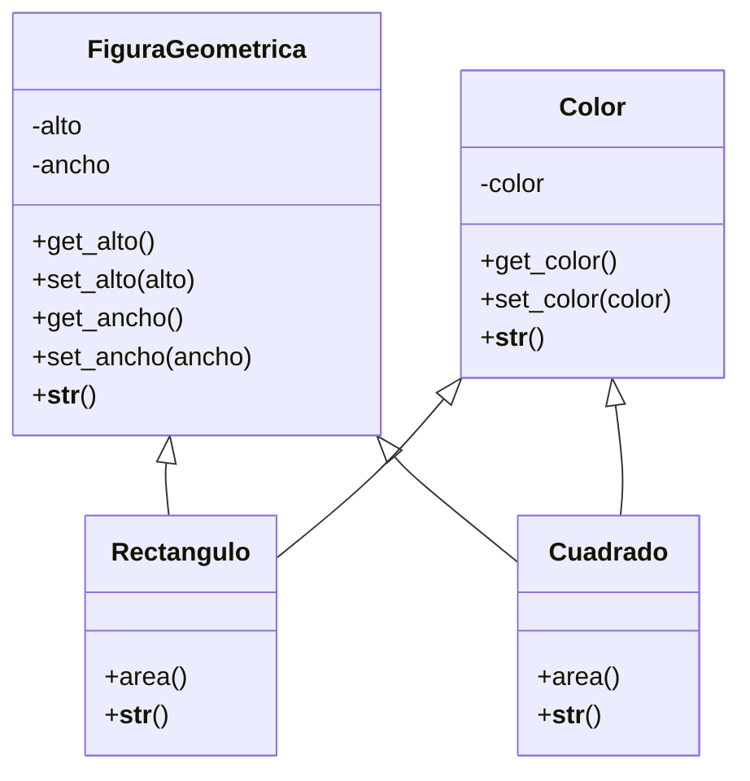

# Herencia múltiple: Figuras geométricas

```mermaid
classDiagram
    class FiguraGeometrica {
        -alto
        -ancho
        +get_alto()
        +set_alto(alto)
        +get_ancho()
        +set_ancho(ancho)
        +__str__()
    }

    class Color {
        -color
        +get_color()
        +set_color(color)
        +__str__()
    }

    class Rectangulo {
        +area()
        +__str__()
    }

    class Cuadrado {
        +area()
        +__str__()
    }

    FiguraGeometrica <|-- Rectangulo
    Color <|-- Rectangulo
    FiguraGeometrica <|-- Cuadrado
    Color <|-- Cuadrado
```